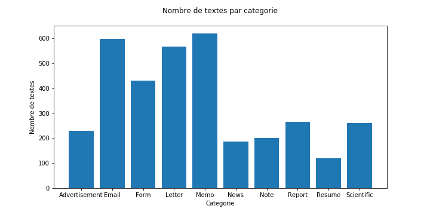

# Classification des documents du procès des groupes américains du tabac
### _Mélodie Boillet - Text Analysis - 22/10/2018_

## Introduction 

Afin de faciliter l'exploitation de documents par les avocats dans le cadre de ce procès, nous devons mettre en place une classification automatique des types de documents. Pour cela, nous disposons d'un échantillon aléatoire de documents qui a été collecté et classifié par des opérateurs selon les catégories suivantes :
  * _Advertisement_,
  * _Email_,
  * _Form_,
  * _Letter_,
  * _Memo_, 
  * _News_, 
  * _Note_,
  * _Report_,
  * _Resume_ et
  * _Scientific_.

Nous allons donc mettre en place une méthodologie de projet de Machine Learning afin de prédire automatiquement les types des documents. 

Tout d'abord, nous analyserons les données dont nous disposons. Nous exposerons ensuite une solution afin de répondre à la problématique et présenterons une implémentation de cette solution. Enfin, nous analyserons les performances de cette solution et détaillerons les possibles pistes d'amélioration.

## 1. Analyse des données. 

La première étape à réaliser ici est d'étudier les données que nous avons à notre disposition. Pour cela, nous avons choisi de visualiser le nombre de textes par catégorie ainsi que le nombre de lettres moyen par type de texte.

### 1.1 Nombre de textes par catégorie. 


Nous voyons ici que les catégories _Email_, _Form_, _Letter_ et _Memo_ sont sur-représentées. De plus, la catégorie _Resume_ est légèrement sous-représentée. Nous ne sommes donc pas dans les conditions optimales pour la suite. Nous aurions préféré avoir une distribution plus ou moins uniforme des catégories. Nous n'en tiendrons pas compte pour la suite mais pourrons revenir sur les données et les uniformiser  plus tard.

### 1.2 Nombre de lettres moyen des textes par catégorie. 


Nous pouvons voir ici que deux catégories se distinguent nettement des autres. Il s'agit des catégories _News_ et _Note_ qui possèdent respectivement des moyennes proches de 3500 et 250 lettres. On peut donc supposer que la catégorie _News_ sera très peu confondue, au regard de cette caractéristique, avec les catégories de petites moyennes : _Advertisement_, _Email_, _Form_ et _Note_. Il est en de même avec la catégorie _Note_ et les catégories de moyennes élevées : _News_, _Report_, _Resume_ et _Scientific_.

## 2. Analyse du problème et présentation de la solution.

La seconde étape consiste à analyser le problème et trouver une solution adaptée afin de le résoudre.

### 2.1 Analyse du problème.

Nous disposons d'environ 3500 textes appartenant à différentes catégories. Ces textes ont été labellisés par des opérateurs, nous considérerons que l'erreur de labellisation est négligeable ici. Nous allons donc nous placer dans un cadre d'apprentissage supervisé afin de catégoriser automatiquement de nouveaux textes.

Pour commencer, nous allons découper l'ensemble des textes en trois ensembles _Train_, _Dev_ et _Test_ selon les proportions suivantes :

_Train_ | _Dev_ | _Test_
------------ | ------------- | -------------
60% | 20% | 20%

### 2.2 Solution envisagée.

Dans un premier temps, nous avons choisi d'utiliser un algorithme simple afin d'avoir des premiers résultats rapidement. Nous avons donc choisi d'implémenter un algorithme de classification naïve Bayésienne. Celui-ci a été choisi car il est adapté à l'apprentissage supervisé, est simple à mettre en oeuvre et donne de bons résultats rapidement.

De plus, nous avons d'abord choisi de représenter nos données comme des sacs de mots. Cette représentation pourra être améliorée par la suite.

### 2.3 Pseudo-code de l'algorithme.

L'idée globale de l'algorithme est présentée ci-dessous : 

```
Début:
  donnees = charger_donnees()
  train, dev, test = separer_donnees()
  train, dev, test = sac_de_mots(train, dev, test)
  train_prediction, dev_prediction, test_prediction = entrainer_tester_classifieur(train, dev, test)
Fin.
```

L'implémentation de cet algorithme se trouve dans le fichier . Une version de ce code est également disponible dans le document .

## 3. Analyse des performances.

### 3.1 Performances.
Après application de cet algorithme, nous obtenons les résultats suivants :


Nous pouvons voir que les résultats sont satisfaisants avec la simple représentation en sac de mots. En effet, nous obtenons presque 72% de textes correctement classifiés pour l'ensemble de tests. Cependant, nous aimerions augmenter cette valeur.

Afin d'améliorer ces résultats, nous avons testé de représenter les données en TF-IDF. Cette représentation permet de mettre moins de poids sur les mots qui apparaissent souvent dans de nombreux documents et qui ne sont pas déterminants.
Nous avons donc le nouvel algorithme suivant :
```
Début:
  donnees = charger_donnees()
  train, dev, test = separer_donnees()
  train, dev, test = sac_de_mots(train, dev, test)
  train_tf, dev_tf, test_tf = tfidf(train, dev, test)
  train_prediction, dev_prediction, test_prediction = entrainer_tester_classifieur(train_tf, dev_tf, test_tf)
Fin.
```

Avec cette nouvelle représentation, nous obtenons les résultats suivants :


Les résultats obtenus sont moins satisfaisants que les premiers. En effet, nous perdons environ 5% de précision avec cette nouvelle représentation. Plusieurs raisons pourrait expliquer cela. Tout d'abord, il manque dans de nombreux textes des espaces entre certains mots, cela a un effet important sur notre représentation car les fréquences d'occurences de ces mots sont biaisées. De plus, nous possédons des documents qui n'apportent presque aucune information utile. C'est notamment le cas du document ci-dessous : 
```
as/@6/1998 12:45 +49-9131-856592 PSYUR. UNIV, Tea

oO .
Dy Thaveel J Er lense

 

(sr se sO 2!

SpZSLrsSOSe
```

Il n'y a aucun texte anglais dans ce document qui puisse être utile à notre modèle. De nombreux textes classés comme _Note_ ne contiennent pas de texte mais seulement des références, dates ou numéros. Ainsi, nous garderons notre premier algorithme avec les sacs de mots.

### 3.2 Analyse des erreurs.

La dernière étape à réaliser ici est d'analyser nos résultats et les erreurs. Cela devra permettre d'améliorer, plus tard, les résultats en passant par une possible correction des données, un changement des paramètres ou un autre algorithme de classification.

Pour faire cette analyse, nous avons décidé de calculer les erreurs de classification en fonction des catégories des documents. Nous obtenons l'analyse suivante pour l'ensemble de test :


Nous voyons que les catégories _Resume_ et _Email_ se distinguent clairement des autres par leurs _f1-score_ très élevés. En effet, pour ces catégories, nous avons plus de 93% de textes correctement classifiés. Cependant, nous constatons également que la catégorie _Note_ a un _f1-score_ particulièrement bas (< 40%). Cela est probablement dû au fait que ces données ne sont pas de très bonne qualité comme énoncé précédemment.
Un traitement spécial sur ces données devrait donc être réalisé au préalable afin de corriger ce résultat.

Nous avons également choisi de calculer la matrice de confusion pour l'ensemble de test. Cela nous permet de voir quelles catégories sont le plus souvent confondues. La matrice obtenue est présentée ci-dessous :


Nous voyons sur cette matrice que les catégories (_Memo_ et _Letter_) et (_Scientific_ et _Report_) sont souvent confondues. Cela n'est pas étonnant sachant que chacun de ces couples possède ont un nombre similaire de textes et les textes ont des longueurs similaires. De plus, la catégorie _Note_ est souvent confondue avec d'autres catégories, cela n'est pas non plus surprenant au vu de son faible _f1-score_. Enfin, on note la confusion entre les catégories (_Scientific_ et _Form_) et (_Report_ et _Memo_). Cela est inattendu car ces documents semblent être de types totalement différents et que les catégories ne sont pas similairement représentées.

## Conclusion

Pour conclure, l'analyse de documents automatique est un sujet complexe où la qualité des données influe beaucoup sur les résultats. L'algorithme choisi ici donne des performances satisfaisantes mais elles peuvent être améliorées. En effet, nous avons des confusions que nous ne pouvons pas forcément expliquer. Une première solution serait d'utiliser une autre représentation des textes et d'effectuer un pré-traitement sur les données afin de les uniformiser et de corriger les données _Memo_. De plus, nous n'avons pas calculé les hyper-paramètres optimaux pour notre algorithme. Une seconde solution serait donc de les chercher et recalculer les performances par la suite.
